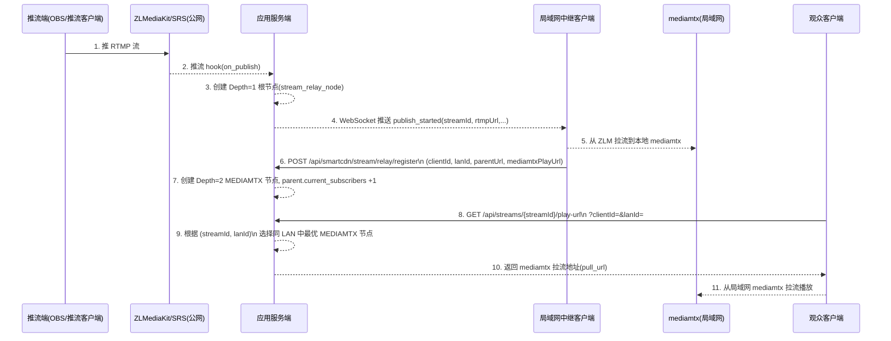

# SmartCDN 设计文档

## 1. 背景与目标

### 1.1 场景

- 当前所有推流统一到公网流媒体平台（ZLMediaKit，未来可能有 SRS）。
- 所有拉流客户端都从公网拉流，哪怕这些客户端其实在同一个局域网内。
- 这样会造成：
  - 公网带宽浪费；
  - 延迟较高；
  - 公网流媒体压力集中。

### 1.2 SmartCDN 目标

SmartCDN 的目标是在传输 RTMP/HTTP(FV/HLS) 流时：

- 当局域网里已经存在某个流的“中继节点”（mediamtx）时：
  - 后续同局域网的观众尽量从局域网内的 mediamtx 拉流；
  - 尽量避免再次从公网 ZLMediaKit/SRS 拉流。
- 建立一棵“流转发树”（最大深度 3）：
  - Depth=1：公网流媒体平台（ZLMediaKit 或 SRS）上的原始流；
  - Depth=2：局域网内第一个 mediamtx，从公网拉一层；
  - Depth=3：局域网内第二层 mediamtx，从上一层 mediamtx 再拉一层。
- 控制 fan-out：
  - 每个节点（不论是 ZLMediaKit/SRS 还是 mediamtx）最多被 N 个下游订阅（当前设为 3）。

整体思路是：服务器维护一棵“拉流拓扑树”，在满足带宽和负载约束的前提下，为每个客户端选择最优的拉流节点（优先局域网）。


## 2. 数据建模：SmartCDN 流节点表

现有的 [StreamInfo](file:///d:/spring-boot-user-registration-and-Login/src/main/java/net/enjoy/springboot/registrationlogin/entity/StreamInfo.java) 已经存储了一条逻辑流的信息（`streamId`、`pushUrl`、`playUrl`、`status` 等）。

SmartCDN 需要一个“拓扑表”来描述：**同一条逻辑流在不同节点（ZLMediaKit/SRS/mediamtx）上的拉流节点关系**。

建议新增一张表（名字可调整）：`stream_relay_node`

### 2.1 字段设计

**标识与关联**

- `id`：主键，自增。
- `stream_id`：逻辑流 ID，对应 `StreamInfo.streamId`，例如 `live/test123`。
- `pull_url`：本节点对外提供的拉流地址（RTMP/FLV/HLS）。

**树结构相关**

- `parent_id`：父节点在本表的 `id`：
  - 公网根节点为 `NULL`；
  - mediamtx 节点的 `parent_id` 指向其上游节点。
- `depth`：整数，表示树深度：
  - `1`：公网流媒体平台上的根节点（ZLMediaKit/SRS）；
  - `2`：第一层 mediamtx 节点；
  - `3`：第二层 mediamtx 节点（上限）。
- 可选：`root_id`：整棵树的根节点 `id`，便于快速查询整棵拓扑。

**平台信息**

- `platform`：枚举值：
  - `ZLMEDIAKIT`：公网 ZLMediaKit；
  - `SRS`：公网 SRS；
  - `MEDIAMTX`：局域网 mediamtx 中继节点。

**订阅控制**

- `max_subscribers`：允许的最大“下游订阅数”，当前需求为 3。
- `current_subscribers`：当前已有多少下游节点。
  - 新下游想从本节点再拉一层时，需要 `current_subscribers < max_subscribers`。
  - 订阅成功后 `+1`，取消订阅或关闭时 `-1`。

**状态与审计信息（建议）**

- `status`：如 `ACTIVE` / `INACTIVE` / `FAILED` 等；
- `created_at` / `updated_at`：创建与更新时间。


## 3. SmartCDN 开关与配置

为保证兼容性，SmartCDN 必须可以一键关闭，不影响现有逻辑。

在 [application.properties](file:///d:/spring-boot-user-registration-and-Login/src/main/resources/application.properties) 中增加配置：

```properties
smartcdn.enabled=true
smartcdn.max-depth=3
smartcdn.max-subscribers-per-node=3
```

在服务端增加配置类读取以上配置，在关键流程处按如下方式分支：

- `if (!smartcdn.enabled)`：保持现有行为：
  - 只使用 ZLMediaKitConfig 生成推流/拉流地址；
  - 不写入 `stream_relay_node` 表；
  - 不走任何 smartCDN 逻辑。
- `if (smartcdn.enabled)`：
  - 维护 `stream_relay_node` 表；
  - 根据拓扑为客户端返回最优拉流节点。


## 4. 后端流程设计（不修改原有逻辑的前提下扩展）

已有关键类：

- [StreamEventMessage](file:///d:/spring-boot-user-registration-and-Login/src/main/java/net/enjoy/springboot/registrationlogin/model/StreamEventMessage.java)：流事件消息模型，包含 `publish_started` 等事件；
- [StreamInfo](file:///d:/spring-boot-user-registration-and-Login/src/main/java/net/enjoy/springboot/registrationlogin/entity/StreamInfo.java)：流信息实体；
- [StreamServiceImpl](file:///d:/spring-boot-user-registration-and-Login/src/main/java/net/enjoy/springboot/registrationlogin/service/StreamServiceImpl.java)：生成推流 URL；
- [ZLMediaKitConfig](file:///d:/spring-boot-user-registration-and-Login/src/main/java/net/enjoy/springboot/registrationlogin/config/ZLMediaKitConfig.java)：生成 ZLM 播放 URL。

SmartCDN 在此基础上做“旁路增强”。

### 4.1 推流开始：创建根节点（Depth=1）

当收到 ZLMediaKit 的推流 hook 时，现有逻辑会：

- 生成 `StreamEventMessage.publishStarted(...)` 并通过 WebSocket 通知；
- 调用 `createOrUpdateStreamInfo` 更新 `stream_info` 表。

在 SmartCDN 开启时，增加步骤：

1. 根据 `streamId` 在 `stream_relay_node` 中查找是否已有 `depth=1` 节点：
   - 若无，则插入：
     - `stream_id = streamId`；
     - `platform = ZLMEDIAKIT`（或 SRS，按 hook 来源判断）；
     - `depth = 1`；
     - `parent_id = NULL`；
     - `pull_url = rtmpUrl`（或你统一使用的主播放地址）；
     - `max_subscribers = smartcdn.max-subscribers-per-node`；
     - `current_subscribers = 0`。
   - 若已有，则略过。

此步骤不改变原有逻辑，只是多记录一层根节点信息。


### 4.2 选择“谁来做局域网 mediamtx 第一个中继”

SmartCDN 不强行指定某个客户端，而是通过信令交互，让客户端“自荐”：

1. 服务端在 `publish_started` 时，将包含 `rtmpUrl/hlsUrl/flvUrl` 的事件广播给一组有权限的客户端。
2. 客户端侧有两个层次的策略：
   - 若局域网内存在“固定服务器”（例如一台常驻机房的边缘节点），其在注册时声明自己具备 `prefer-as-lan-relay` 能力，则优先由它承担该 LAN 内的第一个中继（Depth=2）；
   - 否则，由**第一个加入拉流并具备 `mediamtx-relay` 能力的客户端**来担当该 LAN 的第一个中继。
3. 具体流程（以“第一个拉流的客户端成为中继”为例）：
   - 客户端 C 第一次请求 `streamId` 的播放地址：
     - `GET /api/streams/{streamId}/play-url?clientId=C&lanId=office-1`
   - 服务器：
     - 先查该 `lanId` 下是否已有 mediamtx 节点；
       - 若已有，则直接返回该 mediamtx 的 `pull_url`（C 从局域网拉流）；
       - 若没有，则检查 ZLMediaKit 根节点（Depth=1）是否还有订阅名额（`current_subscribers < max_subscribers`），以及 C 是否具备 `mediamtx-relay` 能力。
     - 若条件满足，可以：
       - 先返回 ZLM 播放地址给 C，让 C 从 ZLM 拉流到本地 mediamtx；
       - 待 C 在本地拉流成功后，再调用 `/api/smartcdn/stream/relay/register` 向服务端注册自己的 mediamtx 节点，服务器将其写入 `stream_relay_node` 表并为 ZLM 根节点 `current_subscribers +1`。

ZLMediaKit 自身的 fan-out 限制也通过根节点的 `max_subscribers`/`current_subscribers` 表现出来：

- 每新增一个“新局域网中继”从 ZLM 拉流，就会增加其 `current_subscribers`；
- 同一 `lanId` 下的后续观众不会直接增加 ZLM 的 fan-out，而是复用该 LAN 中已有的 mediamtx 中继节点；
- 当根节点 `current_subscribers` 达到 `max_subscribers` 时，新的 LAN 将无法再创建中继，只能退回到直接使用公网拉流或被拒绝（按业务策略处理）。


### 4.2.1 LAN 内中继优先级与唯一性规则

在同一个 `lanId` 下，同一条逻辑流 `streamId` 的“第一层局域网中继”（Depth=2，parent 为 ZLM 根节点）遵循以下规则：

1. **优先使用固定 LAN 服务器**
   - 若该 `lanId` 下存在任意一个客户端，在 `client/register` 时上报的 `capabilities` 中包含 `prefer-as-lan-relay`：
     - 则只有具备 `prefer-as-lan-relay` 能力的客户端才被允许注册“第一层 mediamtx 中继”；
     - 不具备该能力的客户端，即使先发起 `/stream/relay/register`，也会被服务端拒绝（返回失败），只能作为普通观众从已有中继拉流。
   - 这样可以保证有固定边缘服务器时，总是由这些“偏好服务器”承担局域网中继角色。

2. **没有固定服务器时，按“先到先得”选中继**
   - 若该 `lanId` 下没有任何客户端声明 `prefer-as-lan-relay`：
     - 同一 `streamId + lanId` 的第一层 mediamtx 中继采用“先到先得”的策略：
       - 服务端在处理 `/stream/relay/register` 时，会检查是否已存在
         `platform = MEDIAMTX AND depth = 2 AND stream_id = streamId AND lan_id = lanId` 的节点；
       - 第一台成功注册的客户端成为该 LAN 下该流的唯一第一层中继；
       - 后续尝试为同一 `streamId + lanId` 注册第一层中继的请求会被拒绝，调用方只应作为观众从已存在的局域网中继拉流。

3. **唯一性保证**
   - 通过在服务端的 `registerRelayNode` 实现中，对
     `stream_relay_node` 表执行“按 `streamId + lanId + depth = 2 + platform = MEDIAMTX` 查询并拒绝重复”：
     - 保证任意时刻，同一个 LAN 内，同一条流只存在一个“从 ZLM 拉流的第一层 mediamtx 中继”；
     - 该中继一旦建立，同 LAN 内的观众再请求播放地址时，统一复用该中继，避免重复从公网拉流。


### 4.3 客户端注册 mediamtx 中继节点（Depth=2/3）

客户端在本地完成：

1. 根据 `publish_started` 提供的公网拉流地址，从 ZLMediaKit/SRS 拉流到本机的 mediamtx；
2. mediamtx 本地暴露一个拉流地址（比如 `rtmp://192.168.3.4:1935/live/xxx`），供同局域网的其他客户端使用。

然后客户端调用服务端 API，例如：

`POST /api/smartcdn/stream/relay/register`

请求体示例：

```json
{
  "clientId": "client-B",
  "lanId": "office-1",
  "streamId": "live/test123",
  "parentUrl": "rtmp://zlm-public/live/test123",
  "mediamtxPullUrl": "rtmp://192.168.3.4:1935/live/test123",
  "mediamtxPlayUrl": "rtmp://192.168.3.4:1935/live/test123"
}
```

服务端逻辑：

1. 根据 `streamId` 和 `parentUrl` 定位父节点：
   - 从 `stream_relay_node` 中查找 `stream_id = streamId AND pull_url = parentUrl`。
2. 检查：
   - `smartcdn.enabled == true`；
   - `parent.depth < smartcdn.max-depth`（否则会超深度）；
   - `parent.current_subscribers < parent.max_subscribers`。
3. 若检查通过：
   - 新增一条 mediamtx 节点记录：
     - `stream_id = streamId`；
     - `platform = MEDIAMTX`；
     - `depth = parent.depth + 1`；
     - `parent_id = parent.id`；
     - `pull_url = mediamtxPlayUrl`；
     - `max_subscribers = smartcdn.max-subscribers-per-node`；
     - `current_subscribers = 0`；
     - 记录 `lan_id`（详见后文）。
   - 同时对父节点：`current_subscribers = current_subscribers + 1` （需要事务保证原子性）。
4. 若检查不通过（深度已满或订阅满）：
   - 返回失败，提示客户端退回使用公网流。


### 4.4 观众获取“最佳拉流地址”

当普通观众客户端想观看某个流时，可以调用统一的“获取播放地址”接口，比如：

`GET /api/streams/{streamId}/play-url?clientId=xxx&lanId=office-1`

服务端逻辑：

1. 若 `smartcdn.enabled == false`：
   - 调用现有逻辑（例如使用 `ZLMediaKitConfig.generatePlayUrl` / `generateFlvUrl`）返回公网 ZLMediaKit/SRS 播放地址。
2. 若开启 SmartCDN：
   - 根据 `streamId` 和 `lanId` 在 `stream_relay_node` 中查询：
     - 优先查找 `platform = MEDIAMTX` 且 `lan_id = 请求中的 lanId` 的节点；
     - 可以按 `depth`（越小越好）和 `current_subscribers`（越低越好）排序，选择最优一个；
   - 若找到合适的 mediamtx 节点：
     - 返回该节点的 `pull_url`；
   - 若找不到（当前 LAN 还没有中继）：
     - 回退为返回 ZLMediaKit/SRS 根节点的 `pull_url`。

客户端拿到地址后：

- 若是 mediamtx 地址：直接设置到 OBS 或播放器；
- 若是公网地址：可选择是否为其再创建一层 mediamtx（即 Depth 进一步加 1）。


### 4.5 中继节点/观众取消订阅

当某个下游观众离开，或 mediamtx 节点准备不再为下游提供服务时，应该通知服务器减少订阅数。

可以设计两个接口：

1. 观众结束观看：

   `POST /api/smartcdn/stream/subscriber/decrease`

   请求中包含：

   ```json
   {
     "clientId": "client-C",
     "streamId": "live/test123",
     "pullUrl": "rtmp://192.168.3.4:1935/live/test123"
   }
   ```

   服务器根据 `streamId + pullUrl` 定位对应节点，对 `current_subscribers` 做 `-1`。

2. mediamtx 节点不再提供转发：

   `POST /api/smartcdn/stream/relay/unregister`

   服务器可以：

   - 将该节点 `status` 设为 `INACTIVE`；
   - 视情况对其子节点进行降级或清理。


## 5. 客户端信令设计

### 5.1 客户端注册自身所在局域网与能力

为解决“不同局域网 IP 相同”的问题，服务器不直接依赖 IP，而是让客户端上报一个逻辑 `lanId`。

注册接口示例：

`POST /api/smartcdn/client/register`

请求体：

```json
{
  "clientId": "client-B",
  "lanId": "office-1",
  "lanIp": "192.168.3.4",
  "mediamtxHttpUrl": "http://192.168.3.4:8888",
  "mediamtxRtmpUrlPrefix": "rtmp://192.168.3.4:1935",
  "capabilities": ["mediamtx-relay"]
}
```

服务器维护一个“客户端表”或缓存，用于根据 `lanId` 找到可用 mediamtx 节点。

**关键点：**

- 即使多个局域网都用 `192.168.3.x`，只要 `lanId` 不同，服务器就不会把 A LAN 的 mediamtx 地址发给 B LAN。
- 一般在客户端配置文件里为每个部署点写一个唯一的 `lanId`。


### 5.2 利用 StreamEventMessage 的 publish_started

现有的 [StreamEventMessage.publishStarted](file:///d:/spring-boot-user-registration-and-Login/src/main/java/net/enjoy/springboot/registrationlogin/model/StreamEventMessage.java#L26) 已经带有：

- `streamId`；
- `userId`；
- `pushUrl`；
- `rtmpUrl`；
- `hlsUrl`；
- `flvUrl`。

在 SmartCDN 中：

- 保持现有字段不变；
- 客户端收到 `publish_started` 后：
  - 如果支持 smartCDN（`capabilities` 中包括 `mediamtx-relay`）；
  - 可以先从 `rtmpUrl` 或 `flvUrl` 拉流到本地 mediamtx，再走前文的 `/stream/relay/register` 流程。


## 6. 多局域网、私网 IP 重复问题的解决

问题：不同的局域网中 IP 可能都是 `192.168.x.x`，如果服务器直接保存 `rtmp://192.168.3.4:1935/...`，就无法知道这个地址属于哪个 LAN。

解决方案：

1. 引入 `lanId` 作为逻辑局域网标识（配置在客户端或部署脚本里）。
2. 客户端在注册自己能力时，上报：
   - `clientId`；
   - `lanId`；
   - `mediamtx` 的地址与端口。
3. `stream_relay_node` 表中增加 `lan_id` 字段：
   - mediamtx 节点插入时写入其 `lanId`；
   - 查询最优拉流地址时，始终以 `(streamId, lanId)` 为条件，只返回同 LAN 的 mediamtx 节点。
4. 如果某个 LAN 的 mediamtx 地址变更：
   - 由该 LAN 中的客户端重新调用 `client/register` 更新配置；
   - 之后新建立的节点都会使用新的地址。

这样即可保证：

- 即便多个 LAN 都有 `192.168.3.4`，服务器仍然可以根据 `lanId` 精确地选择正确的 mediamtx 地址。

在实际实现中，可以按以下“三层方案”逐步演进：

1. **方案 A：手工配置 lanId（推荐起步方案）**
   - 每个物理局域网环境配置一个唯一的 `lanId`（例如 `sh-office-1`、`bj-office-2`）；
   - 客户端从本地配置文件读取并上报 `lanId`；
   - 服务器仅根据 `(streamId, lanId)` 选择局域网中继节点。
   - 优点：简单稳定，完全可控，适合当前受控部署场景。

2. **方案 B：公网出口 IP 兜底**
   - 当客户端未配置 `lanId` 时，可以用“出口公网 IP”作为粗粒度的默认 `lanId`：
     - 服务器从请求里拿到 `remoteAddr`（公网 IP），拼成 `lanId = "ip-" + remoteAddr`；
   - 适用于“一条公网 IP 后面就是一个 LAN”的简单场景；
   - 在复杂网络中只作为兜底，不作为唯一方案。

3. **方案 C：局域网内部自动协商 UUID（高级选项）**
   - 客户端在本地还没有 `lanId` 时，通过 UDP 组播/广播在局域网内询问：
     - 若发现已有客户端返回 `lanId`，则复用该值；
     - 否则由某个客户端生成一个随机 UUID 作为 `lanId`，并在后续响应中告知其它客户端。
   - 这样在同一二层网络中的客户端最终会收敛到同一个 `lanId`，而不同 LAN 因广播不互通，会自然生成不同的 `lanId`。
   - 实现复杂度较高，可作为未来自动化升级方向。

   **方案 C 实现细节示例（可选）：**

   - 建议约定一组固定的 UDP 组播地址和端口，例如：
     - 组播地址：`239.192.0.1`
     - 端口：`34567`
     - TTL：`1`（确保仅在本地局域网内传播）
   - 启动流程（伪协议）：
     1. 客户端启动时先检查本地配置文件是否已有 `lanId`：
        - 若有，直接使用配置值，不再自动协商；
        - 若无，则进入自动协商流程。
     2. 客户端加入 `239.192.0.1:34567` 组播组，发送 `DISCOVER_LANID` 消息，负载包含：
        - 一个随机 `requestId`（避免响应串扰）；
        - `clientId`；
        - 可选的客户端版本、能力信息。
     3. 已经持有 `lanId` 的客户端收到 `DISCOVER_LANID` 后，在随机延迟（例如 50~200ms）后回复 `LANID_RESPONSE` 消息，负载包含：
        - 原始 `requestId`；
        - 本机持有的 `lanId`。
     4. 发起方在一定时间窗口内（例如 1~2 秒）收集 `LANID_RESPONSE`：
        - 若收到一个或多个响应，则从中选择一个 `lanId`（例如第一个或按字典序最小），作为本机 `lanId`；
        - 若一个响应都没有，则本机生成一个新的 UUID 作为 `lanId`，并开始在后续对其他 `DISCOVER_LANID` 请求进行响应。
   - 如此一来：
     - 同一二层网络中所有客户端通过 UDP 组播互相发现，最终会共享同一个 `lanId`；
     - 不同局域网之间由于广播/组播不会跨路由器，自然会生成不同的 `lanId`；
     - 服务器只看到一个逻辑 `lanId`，而不用关心具体的私网网段（192.168/10.0 等）。
   - 生产环境中仍然建议保留“显式配置 `lanId`”的能力：
     - 自动协商失败或不适用时，可以直接通过配置覆盖；
     - 管理员也可以人为指定更有语义的 `lanId`（如 `sh-office-1`），取代自动生成的 UUID。


## 7. 实现建议与演进路线

在不修改现有核心逻辑的前提下，可以按以下步骤逐步落地 SmartCDN：

1. **数据层**
   - 新建 `stream_relay_node` 表及对应 JPA Entity/Repository；
   - 在 ZLM 推流 hook 处理逻辑中，创建 Depth=1 根节点（不影响现有流程）。

2. **配置层**
   - 增加 `smartcdn.enabled`、`smartcdn.max-depth`、`smartcdn.max-subscribers-per-node` 配置；
   - 新建配置类注入这些值，在相关服务中按开关分支逻辑。

3. **API 层**
   - 增加：
     - `/api/smartcdn/client/register`；
     - `/api/smartcdn/stream/relay/register`；
     - `/api/smartcdn/streams/{streamId}/play-url`；
     - `/api/smartcdn/stream/subscriber/decrease`（可选）。

4. **客户端**
   - 在启动时调用 `client/register` 上报 `lanId` 与 mediamtx 信息；
   - 收到 `publish_started` 后：
     - 若本机适合作为中继，启动 mediamtx 拉流；
     - 调用 `stream/relay/register` 将 mediamtx 节点注册到服务器；
   - 普通观众在播放前调用 `play-url` 接口拿到最佳拉流地址（本地 mediamtx 或公网 ZLM）。

5. **演进**
   - 后续可以在此基础上增加：
     - 更复杂的负载均衡策略（按 CPU、带宽、延迟等）；
     - 支持更多平台（SRS 等）作为 Depth=1 根；
     - 对树的清理策略（长时间无订阅自动下线 mediamtx 节点）。


## 8. SmartCDN 核心时序图

下面给出一个典型的端到端时序图，覆盖以下关键步骤：

- 主播向 ZLMediaKit 推流；
- 服务端创建 Depth=1 根节点并广播 `publish_started`；
- 某个局域网客户端作为中继，从 ZLMediaKit 拉流到本地 mediamtx，并向服务端注册；
- 普通观众根据 `lanId` 向服务端申请播放地址并从局域网 mediamtx 拉流。




## 9. SmartCDN 独立模块说明

为方便后续维护和演进，SmartCDN 在代码结构上被封装为一个相对独立的功能模块，仅通过少数清晰的接口与现有系统交互。

1. **模块组成**
   - 配置：
     - `SmartCdnConfig`：读取 `smartcdn.enabled`、`smartcdn.max-depth`、`smartcdn.max-subscribers-per-node` 等配置。
   - 实体与表：
     - `StreamRelayNode`：对应 `stream_relay_node`，描述整棵拉流拓扑树（ZLM/SRS 根 + 各层 mediamtx 中继）。
     - `SmartCdnClient`：对应 `smartcdn_client`，记录客户端的 `lanId`、mediamtx 地址与 `capabilities`（如 `mediamtx-relay`、`prefer-as-lan-relay`）。
   - 仓库：
     - `StreamRelayNodeRepository`：封装拓扑节点的查询与更新；
     - `SmartCdnClientRepository`：封装客户端注册信息的存取。
   - 服务：
     - `SmartCdnService` / `SmartCdnServiceImpl`：SmartCDN 核心业务逻辑入口：
       - 维护根节点与中继节点（`ensureRootNode`、`registerRelayNode`）；
       - 根据 `(streamId, lanId)` 选择最佳拉流地址（`getBestPlayUrl`）；
       - 结合 `capabilities` 实现 LAN 内中继优先级与唯一性规则。
   - API：
     - `SmartCdnController` 暴露对外 REST 接口：
       - `POST /api/smartcdn/client/register`；
       - `POST /api/smartcdn/stream/relay/register`；
       - `GET /api/smartcdn/streams/{streamId}/play-url`。

2. **对外集成点（与现有系统的边界）**
   - ZLMediaKit 推流 hook 集成：
     - 在 `ExZlmHookController.onPublish` 中，完成原有流状态更新和 `publish_started` 事件推送后，额外调用：
       - `smartCdnService.ensureRootNode(streamId, rtmpUrl)`；
     - 用于在 SmartCDN 模块内创建/维护 Depth=1 的根节点，不改变原有推流鉴权与事件通知逻辑。
   - 观众/中继客户端：
     - 不直接依赖内部实现细节，仅通过 SmartCDN 提供的 REST 接口交互：
       - 注册自身能力（`client/register`）；
       - 作为中继时向服务器登记拓扑（`stream/relay/register`）；
       - 作为观众时获取最佳拉流地址（`streams/{streamId}/play-url`）。

3. **开关与隔离**
   - 全局开关：`smartcdn.enabled` 默认为 `false`：
     - 关闭时：
       - `SmartCdnService` 内部方法直接回退到现有的 ZLMediaKit URL 生成逻辑；
       - 不写入 `stream_relay_node` / `smartcdn_client`，不影响现有行为。
     - 开启时：
       - 激活 SmartCDN 的拓扑维护和智能选路逻辑；
       - 其他业务代码仍然只需依赖 `SmartCdnService` 暴露的少量方法，而无需感知内部表结构。

通过以上封装，SmartCDN 可以作为一个独立功能模块被理解和维护：其内部负责“流拓扑 + 局域网中继选择 + 最优拉流地址决策”，对外只暴露少量清晰的配置项、REST 接口和服务调用点。


以上即为 SmartCDN 的整体设计与数据建模说明，后续实现时可以严格按照“不开启开关不改变现有行为”的原则逐步接入。
