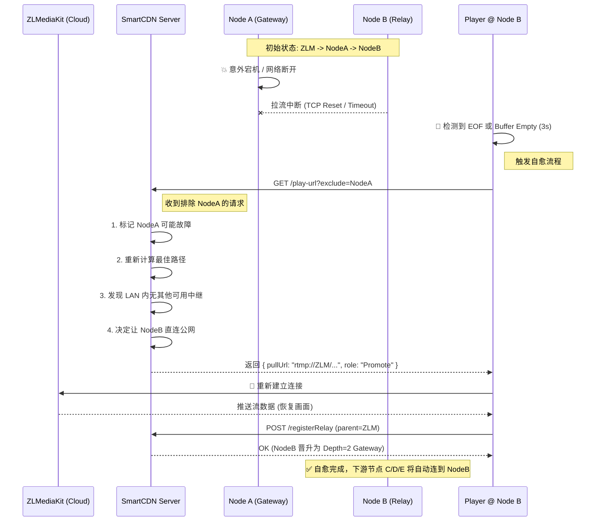

# SmartCDN 功能测试指南（基于 Swagger-UI）

本文档指导你使用 Swagger-UI 对 SmartCDN 的 5 个核心接口做端到端测试，帮助你从「服务器能力」角度理解 SmartCDN，为后续客户端开发打基础。

测试覆盖：
- 客户端加入 / 注册
- LAN 中继注册（包含 prefer-as-lan-relay 优先和唯一性规则）
- 播放地址获取（含 LAN 内优先与回退逻辑）
- 客户端退出 / 离线行为说明

---

## 1. 前置条件

- Spring Boot 服务已启动，地址：
  - `http://localhost:8080`
- Swagger-UI 地址：
  - `http://localhost:8080/swagger-ui/index.html`
- 配置中启用 SmartCDN：

```properties
smartcdn.enabled=true
```

- ZLMediaKit 正常工作，存在至少一条可用的流，例如：
  - `streamId = live/test-stream`

---

## 2. Swagger-UI 中的 SmartCDN 接口

在 Swagger-UI 页面中搜索或展开 `smart-cdn-controller`，会看到 5 个接口：

1. `POST /api/smartcdn/client/register` —— 客户端注册（registerClient）
2. `POST /api/smartcdn/stream/relay/register` —— 中继节点注册（registerRelay）
3. `GET /api/smartcdn/streams/{streamId}/play-url` —— 播放地址获取（getPlayUrl）
4. `DELETE /api/smartcdn/client/{clientId}` —— 客户端注销（deleteClient）
5. `DELETE /api/smartcdn/streams/{streamId}/relays` —— 中继节点删除（deleteRelay）

使用 Swagger-UI 的通用步骤：
1. 点击接口条目展开
2. 点击 **Try it out**
3. 填写参数
4. 点击 **Execute**
5. 查看请求 URL 和 Response Body

---

## 3. 接口与参数说明

### 3.1 客户端注册：`POST /api/smartcdn/client/register`

DTO：`SmartCdnClientRegisterRequest`

#### 请求体示例

```json
{
  "clientId": "obs-client-001",
  "lanId": "office-1",
  "lanIp": "192.168.1.10",
  "mediamtxHttpUrl": "http://192.168.1.10:8888",
  "mediamtxRtmpUrlPrefix": "rtmp://192.168.1.10:1935/live",
  "capabilities": [
    "prefer-as-lan-relay"
  ]
}
```

#### 字段说明

| 字段名                  | 必填 | 说明 |
|-------------------------|------|------|
| `clientId`              | 是   | 客户端唯一 ID（OBS 节点 ID）。|
| `lanId`                 | 是   | LAN ID，同一局域网必须一致。|
| `lanIp`                 | 否   | 客户端在 LAN 内的 IP。|
| `mediamtxHttpUrl`       | 否   | 本机 MediaMTX HTTP 地址。|
| `mediamtxRtmpUrlPrefix` | 否   | 本机 MediaMTX RTMP 推流前缀。|
| `capabilities`          | 否   | 能力列表，关键值：`prefer-as-lan-relay`。|

> 服务端逻辑：`clientId` 与 `lanId` 任一为空都会直接返回，不保存。

#### 响应

成功：

```json
{ "success": true }
```

异常时返回 500 和错误字符串。

---

### 3.2 中继注册：`POST /api/smartcdn/stream/relay/register`

DTO：`SmartCdnRelayRegisterRequest`

#### 请求体示例

```json
{
  "clientId": "obs-client-001",
  "lanId": "office-1",
  "streamId": "live/test-stream",
  "parentUrl": "rtmp://zlm-host:1935/live/test-stream",
  "mediamtxPullUrl": "rtmp://192.168.1.10:1935/live/test-stream",
  "mediamtxPlayUrl": "http://192.168.1.10:8080/live/test-stream.flv"
}
```

#### 字段说明

| 字段名            | 必填 | 说明 |
|-------------------|------|------|
| `clientId`        | 否   | 当前中继所在客户端 ID，用于判断能力。|
| `lanId`           | 否   | 当前中继所在 LAN ID。|
| `streamId`        | 是   | 流 ID，例如 `live/test-stream`。|
| `parentUrl`       | 是   | 父节点拉流地址（用来定位父节点）。|
| `mediamtxPullUrl` | 否   | 当前 MediaMTX 从父节点拉流的地址。|
| `mediamtxPlayUrl` | 否   | 当前节点对下游提供的播放地址，优先生效。|

#### 关键规则（服务端实现）

1. 基本校验：
   - `smartcdn.enabled=false` → 直接返回 `success=false`
   - `streamId` 或 `parentUrl` 为空 → 返回 `success=false`
   - 找不到 `streamId + parentUrl` 对应父节点 → 返回 `success=false`
   - 父节点深度 ≥ `maxDepth` → 返回 `success=false`
   - 父节点订阅数 ≥ `maxSubscribers` → 返回 `success=false`

2. LAN 第一层中继规则（父节点为 ZLM，且 depth=1，且传入了 `lanId`）：
   - **唯一性**：同一 `streamId + lanId` 下，只允许一个 depth=2 的 `MEDIAMTX` 节点。如果已有，新的注册返回 `success=false`。
   - **prefer 优先**：
     - 如果该 LAN 下存在任意 `prefer-as-lan-relay` 客户端，而当前 `clientId` 对应客户端 *没有* 该能力，则返回 `success=false`。
     - 当前客户端有 `prefer-as-lan-relay` 能力时，可以成功注册。

#### 响应

```json
{ "success": true }
```

或：

```json
{ "success": false }
```

失败原因需要结合日志/数据库排查。

---

### 3.3 播放地址获取：`GET /api/smartcdn/streams/{streamId}/play-url`

方法签名：`getPlayUrl(String streamId, String lanId)`

#### 参数

- 路径参数：
  - `streamId`（必填），例如 `live/test-stream`
- 查询参数：
  - `lanId`（可选），例如 `office-1`

示例 URL：

```text
GET /api/smartcdn/streams/live/test-stream/play-url?lanId=office-1
```

#### 响应结构

成功示例：

```json
{
  "success": true,
  "streamId": "live/test-stream",
  "pullUrl": "http://192.168.1.10:8080/live/test-stream.flv",
  "platform": "MEDIAMTX",
  "lanId": "office-1"
}
```

字段说明：

| 字段名     | 说明 |
|------------|------|
| `success`  | 是否找到可用播放地址。|
| `streamId` | 流 ID。|
| `pullUrl`  | 建议使用的播放地址。|
| `platform` | 地址来源平台：`MEDIAMTX` 或 `ZLMEDIAKIT`。|
| `lanId`    | 命中中继节点时为该节点的 LAN，否则为 null。|
| `message`  | 失败时的错误信息。|

#### 回退逻辑

1. `smartcdn.enabled=false`：
   - 尝试根据 `streamId` 构造 ZLM 播放地址，`platform="ZLMEDIAKIT"`。
   - 构造失败 → `success=false`，`message="SmartCDN disabled and stream not found"`。

2. SmartCDN 启用 + 请求带 `lanId`：
   - 优先查找该 `streamId + lanId` 下的活跃 `MEDIAMTX` 节点列表（已按优先级排好）。
   - 命中 → 返回对应中继的 `pullUrl`，`platform="MEDIAMTX"`，`lanId` 为该节点的 LAN。

3. 不满足以上条件：
   - 若存在 depth=1、platform=ZLMEDIAKIT 的根节点 → 返回其 `pullUrl`（`ZLMEDIAKIT`）。
   - 否则 fallback 到 ZLM 播放地址构造。
   - 若最终仍找不到 → `success=false`，`message="Stream not found"`。

---

## 4. 场景演练：流已就绪，首个客户端接入

本章节模拟你描述的场景：**“已经向服务器推了一个流，然后第一个客户端加入到房间”**。

### 4.1 初始状态确认

假设主播已经通过 OBS 向 ZLMediaKit 推流成功。
- 流 ID：`live/test-stream`
- ZLM 源站播放地址：`rtmp://zlm-host:1935/live/test-stream`
- **服务端状态**：此时数据库 `stream_relay_node` 表中应有一条 `depth=1`、`platform=ZLMEDIAKIT` 的根节点记录（通常由 ZLM Hook 自动创建，测试时可假设已存在）。

### 4.2 第一步：客户端身份注册

**目的**：客户端启动后，首先向 SmartCDN 报到，声明自己的 LAN 归属和能力。

- **接口**：`POST /api/smartcdn/client/register`
- **场景**：客户端 A（`obs-client-001`）在 `office-1` 局域网上线。

**Swagger 操作**：
```json
{
  "clientId": "obs-client-001",
  "lanId": "office-1",
  "lanIp": "192.168.1.10",
  "mediamtxHttpUrl": "http://192.168.1.10:8888",
  "mediamtxRtmpUrlPrefix": "rtmp://192.168.1.10:1935/live",
  "capabilities": ["prefer-as-lan-relay"]
}
```
> **结果**：服务端记录该客户端在线，并在数据库中将其标记为 `prefer-as-lan-relay`（LAN 内优先中继）。

### 4.3 第二步：客户端请求播放地址

**目的**：客户端要播放流，询问 SmartCDN “我该去哪拉流？”。

- **接口**：`GET /api/smartcdn/streams/{streamId}/play-url`
- **参数**：
  - `streamId`: `live/test-stream`
  - `lanId`: `office-1`

**Swagger 操作**：
```text
GET /api/smartcdn/streams/live/test-stream/play-url?lanId=office-1
```

**预期响应（关键）**：
因为它是 **第一个** 加入该 LAN 的客户端，此时 LAN 内还没有中继节点。
SmartCDN 会 **回退** 到 ZLM 源站地址：
```json
{
  "success": true,
  "streamId": "live/test-stream",
  "pullUrl": "http://zlm-host:8080/live/test-stream.flv",
  "platform": "ZLMEDIAKIT",
  "lanId": null
}
```
> **动作**：客户端拿到这个 `pullUrl`，开始播放（拉流）。

### 4.4 第三步：客户端建立中继（核心步骤）

**目的**：客户端拉流成功后，发现自己有 `MEDIAMTX` 能力，于是向服务器注册中继，告诉大家“我现在也是一个源了”。

- **接口**：`POST /api/smartcdn/stream/relay/register`
- **时机**：客户端内部播放器启动成功后触发。

**Swagger 操作**：
```json
{
  "clientId": "obs-client-001",
  "lanId": "office-1",
  "streamId": "live/test-stream",
  "parentUrl": "http://zlm-host:8080/live/test-stream.flv", 
  "mediamtxPullUrl": "rtmp://192.168.1.10:1935/live/test-stream",
  "mediamtxPlayUrl": "http://192.168.1.10:8080/live/test-stream.flv"
}
```
*注意：`parentUrl` 填的是上一步获取到的播放地址（即 ZLM 源站地址）。*

**预期响应**：
```json
{ "success": true }
```

> **结果**：
> 此时，SmartCDN 服务端在 `stream_relay_node` 表中创建了一条新记录：
> - `streamId`: `live/test-stream`
> - `lanId`: `office-1`
> - `platform`: `MEDIAMTX`
> - `depth`: 2 (因为父节点是 ZLM)
>
> **至此，第一个客户端的接入流程闭环完成。** 
> 之后如果有 **第二个** 客户端（同在 `office-1`）加入，调用 `getPlayUrl` 时，就会直接拿到 `obs-client-001` 的地址，实现 LAN 内流量节省。

---

## 5. 场景演练二：多客户端接入（第 2、3、4、5 个客户端）

本章节延续场景一，演示后续客户端如何接入。
**核心原则**：公网服务器只提供一条流（给每个 LAN 的第一个节点），后续同 LAN 客户端全部复用内网流量。

### 5.1 第二个客户端（同 LAN 复用）

**场景**：`office-1` 来了第二个客户端 `obs-client-002`。

1.  **注册客户端** (`POST /register`)
    *   参数：`clientId="obs-client-002"`, `lanId="office-1"`。
2.  **获取播放地址** (`GET /play-url`)
    *   请求：`streamId="live/test-stream"`, `lanId="office-1"`。
    *   **预期响应**：
        ```json
        {
          "success": true,
          "pullUrl": "http://192.168.1.10:8080/live/test-stream.flv",
          "platform": "MEDIAMTX",
          "lanId": "office-1"
        }
        ```
    *   **解析**：SmartCDN 发现 `office-1` 已经有中继节点（`obs-client-001`，IP `192.168.1.10`），直接返回内网地址。
    *   **结果**：`obs-client-002` 从 `obs-client-001` 拉流。**公网带宽消耗：0。**

### 5.2 第三个客户端（新 LAN 开辟）

**场景**：`office-2`（另一个局域网）来了第三个客户端 `obs-client-003`。

1.  **注册客户端** (`POST /register`)
    *   参数：`clientId="obs-client-003"`, `lanId="office-2"`。
2.  **获取播放地址** (`GET /play-url`)
    *   请求：`streamId="live/test-stream"`, `lanId="office-2"`。
    *   **预期响应**：
        ```json
        {
          "success": true,
          "pullUrl": "http://zlm-host:8080/live/test-stream.flv", 
          "platform": "ZLMEDIAKIT",
          "lanId": null
        }
        ```
    *   **解析**：`office-2` 还没有中继，所以回退到 ZLM 源站。
3.  **建立中继** (`POST /relay/register`)
    *   `obs-client-003` 发现自己从源站拉流，决定贡献带宽。
    *   参数：`parentUrl="http://zlm-host..."`, `lanId="office-2"`。
    *   **结果**：`office-2` 现在也有了中继节点。

### 5.3 第四个、第五个客户端（大规模并发）

**场景**：`office-1` 又来了 `obs-client-004` 和 `obs-client-005`。

1.  **注册客户端**：分别注册，`lanId` 都是 `office-1`。
2.  **获取播放地址**：
    *   都调用 `GET /play-url?lanId=office-1`。
    *   **预期响应**：全部返回 `http://192.168.1.10:8080/...`（即 `obs-client-001` 的地址）。
3.  **总结**：
    *   **office-1**：Client 1 (中继) + Client 2, 4, 5 (观众)。公网流：1 路。
    *   **office-2**：Client 3 (中继)。公网流：1 路。
    *   **总计**：5 个客户端在线，公网服务器只承担了 2 路推流压力。

### 5.4 关于负载均衡与网络压力的策略（进阶）

**问题**：如果 `office-1` 内有 100 个客户端，全部从 `obs-client-001` 拉流，会导致该节点带宽耗尽（单点瓶颈）。

**SmartCDN 的应对策略（级联分发）**：

虽然当前演示使用的是“单层中继”，但 SmartCDN 的架构支持 **多级级联（Tree Structure）**。

**操作步骤**：
1.  **检测压力**：当 `obs-client-001` 负载过高时（需要在客户端实现检测逻辑）。
2.  **新中继加入**：`obs-client-002`（原本是观众）可以主动向服务器注册成为 **二级中继**。
    *   接口：`POST /relay/register`
    *   参数：`parentUrl="http://192.168.1.10..."`（即 `obs-client-001` 的地址）。
    *   结果：`obs-client-002` 变为 `depth=3` 的节点。
3.  **流量分担**：
    *   后续加入的 `obs-client-006` 调用 `getPlayUrl` 时。
    *   服务端根据负载均衡算法（需开启 `maxSubscribers` 限制），将新用户引导至 `obs-client-002`（Depth 3）。
    *   **拓扑变化**：Server -> Client 1 -> Client 2 -> Client 6。

**总结**：通过将“星型结构”演进为“树型结构”，将局域网内的流量压力分散到多个节点，理论上可支持无限的内网并发。

---

## 8. 客户端开发者视角总结（流程确认）

基于你的理解，以下是 **客户端开发必须实现的完整逻辑闭环**，请仔细核对。

### 核心问题：Client-2, Client-3 需要注册中继吗？
**答案：是的，强烈建议注册。**

虽然 Client-2 从 Client-1 拉流后，已经解决了“自己观看”的问题，但为了整个局域网的**扩展性（Load Balancing）**，Client-2 也应该尝试注册为中继。
*   **如果不注册**：Client-1 最多只能带 3 个观众（假设配置为 3）。第 5 个观众进来时，Client-1 满了，就没人能服务了。
*   **如果注册**：Client-2 成为 Client-1 的下级（Depth 3），它可以服务 Client-5, Client-6。这样局域网的承载能力就线性增加了。

### 推荐的客户端统一逻辑（伪代码）

客户端不需要判断“我是第几个”，也不需要判断“我是否需要注册”。**只要拉流成功，且具备中继能力，就应该尝试注册。** 逻辑如下：

```javascript
// 1. 上报身份
registerClient(myClientId, myLanId);

// 2. 获取拉流地址
response = getPlayUrl(streamId, myLanId);
if (!response.success) {
    alert("无法观看");
    return;
}

// 3. 开始拉流播放（同时启动本地 MediaMTX 转发）
startPlayer(response.pullUrl);
startMediaMtxProxy(response.pullUrl); // 将拉到的流转发为本地流

// 4. 【关键】无条件尝试注册中继
// 无论 response.pullUrl 是来自 公网源站 还是 局域网邻居，
// 只要我开始拉流了，我就告诉服务器：“我也能提供服务，我的上级是 xxx”
registerRelay({
    clientId: myClientId,
    lanId: myLanId,
    streamId: streamId,
    parentUrl: response.pullUrl, // 关键：告诉我从哪里拉的，服务器会自动计算拓扑关系
    mediamtxPlayUrl: myLocalIp + "/live/stream" // 我能提供的播放地址
});

// 服务器端会自动处理：
// - 如果我是第一个（连源站）：注册成功，我是 Depth 2。
// - 如果我是第二个（连 Client-1）：注册成功，我是 Depth 3。
// - 如果层级太深（超过 maxDepth）：服务器返回 false，我只做观众，不注册。
// 客户端只需“尝试注册”，无需关心结果。
```

### 修正后的完整流程图

1.  **Client 1 上线** -> `getPlayUrl` (返回源站) -> 播放 -> **注册中继** (成功, Depth=2)。
2.  **Client 2 上线** -> `getPlayUrl` (返回 Client 1) -> 播放 -> **注册中继** (成功, Depth=3)。
3.  **Client 3 上线** -> `getPlayUrl` (返回 Client 1) -> 播放 -> **注册中继** (成功, Depth=3)。
4.  **Client 4 上线** -> `getPlayUrl` (Client 1 满了, 返回 Client 2) -> 播放 -> **注册中继** (尝试注册, 视 maxDepth 配置而定)。

**总结**：客户端策略应为 **"Always Try (总是尝试注册)"**，由服务器根据网络拓扑和负载策略来决定是否接受。这样既简单，又能最大化利用局域网带宽。

## 9. SmartCDN 弹性自愈架构设计 (Elastic Self-Healing Architecture)

本节阐述 SmartCDN 如何应对网络抖动、节点宕机等分布式系统常见故障。我们的设计目标是实现 **“流体网络 (Fluid Network)”** —— 网络拓扑不是僵硬的树，而是像水流一样，当某条路径被阻断时，自动寻找新的路径继续流动。

### 9.1 核心机制：客户端驱动的动态重组

传统 CDN 依赖中心化的心跳检测（Keep-Alive），通常有 30s-60s 的延迟。SmartCDN 采用 **“数据面驱动 (Data-Plane Driven)”** 的故障检测机制，利用客户端播放器的实时状态来触发拓扑重组，将恢复时间缩短至 **秒级**。

**关键原则：**
1.  **断流即信号**：播放器缓冲区耗尽是比 TCP 心跳更准确的故障信号。
2.  **黑名单重路由**：客户端在重连时必须显式排除故障节点。
3.  **无状态依赖**：客户端不保存邻居表，完全依赖服务器计算下一跳。

### 9.2 故障恢复时序图 (Failover Sequence)

以下展示了当 LAN Gateway (节点 A) 意外宕机时，下游节点 (节点 B) 如何自动切换到新路径并晋升角色的全过程。



### 9.3 客户端高级状态机 (Advanced Client State Machine)

为了实现上述逻辑，客户端应实现如下的伪代码逻辑。建议封装为 `SmartCdnManager` 类。

```javascript
class SmartCdnManager {
    constructor() {
        this.currentUrl = null;
        this.badNodes = new Set(); // 临时黑名单 (TTL 1分钟)
        this.retryCount = 0;
    }

    async onPlayError(error) {
        console.warn(`[SmartCDN] Stream error: ${error}. Initiating failover...`);
        
        // 1. 将当前故障节点加入黑名单
        if (this.currentUrl) {
            this.badNodes.add(this.currentUrl);
            // 设定 60s 后自动移出黑名单，给它复活的机会
            setTimeout(() => this.badNodes.delete(this.currentUrl), 60000);
        }

        // 2. 指数退避重试 (避免瞬间风暴)
        const delay = Math.min(1000 * Math.pow(2, this.retryCount), 5000);
        await sleep(delay);

        // 3. 请求新路径
        try {
            const newRoute = await this.fetchNewRoute();
            if (newRoute) {
                this.retryCount = 0; // 重置计数
                await this.switchStream(newRoute);
            } else {
                this.retryCount++;
                this.onPlayError("No route found"); // 递归重试
            }
        } catch (e) {
            this.retryCount++;
            this.onPlayError(e);
        }
    }

    async fetchNewRoute() {
        // 关键：将 badNodes 列表传给服务器，或者在本地轮询时跳过
        // 实际 API 调用中，建议在 Header 或 Query 中携带 excludeList
        const response = await api.getPlayUrl({
            streamId: this.streamId,
            lanId: this.lanId,
            exclude: Array.from(this.badNodes).join(',') 
        });

        if (response.success && !this.badNodes.has(response.pullUrl)) {
            return response.pullUrl;
        }
        return null;
    }

    async switchStream(url) {
        console.log(`[SmartCDN] Switching to new route: ${url}`);
        this.currentUrl = url;
        await this.player.load(url);
        
        // 4. 成功播放后，立即注册自己的新身份
        // 这样下游节点如果也断了，就能发现我这个新入口
        await api.registerRelay({
            parentUrl: url,
            lanId: this.lanId
            // ...其他参数
        });
    }
}
```

### 9.4 服务端调度策略 (Server Scheduling Strategy)

服务端配合客户端的自愈请求，执行以下逻辑：

1.  **被动故障标记**：当收到带有 `exclude=NodeA` 的请求时，临时降低 NodeA 的优先级（Score Punishment），或者直接将其标记为 `Suspect` 状态。
2.  **动态选主 (Dynamic Leader Election)**：
    *   如果 LAN 中唯一的 Gateway (Depth 2) 被排除，服务器必须立即打破 "Max Gateway = 1" 的限制（如果有的话），或者直接指定请求者成为新的 Gateway。
    *   算法倾向于选择 `CurrentSubscribers` 较少且 `StabilityScore` (在线时长) 较高的节点作为新父节点。
3.  **最终一致性**：通过客户端不断的重试和注册，拓扑结构会最终收敛到一个稳定的新树状结构，而无需人工干预。

### 9.5 总结

这套方案将 **CDN 的高可用性** 下沉到了 **P2P/LAN 边缘**。它不依赖昂贵的硬件冗余，而是利用软件定义的逻辑，让每一个普通的客户端都能成为网络鲁棒性的一部分。


---

## 6. 场景三：播放地址回退逻辑

### 6.1 LAN 无中继但指定了 lanId

假设 `streamId = live/another-stream`：
- 只有 ZLM 根节点，未注册任何 MediaMTX 中继。

请求：

```text
GET /api/smartcdn/streams/live/another-stream/play-url?lanId=office-1
```

预期：
- 若存在 ZLM 根节点：
  - `success=true`
  - `platform="ZLMEDIAKIT"`
  - `lanId=null`
  - `pullUrl` 为 ZLM 播放地址。

### 6.2 不指定 lanId

对已有中继的 `live/test-stream`：

```text
GET /api/smartcdn/streams/live/test-stream/play-url
```

预期：
- 常见策略是返回 ZLM 根节点地址：
  - `platform="ZLMEDIAKIT"`
  - `lanId=null`

可视为「公网观众」或「未知 LAN」，不走 LAN 内中继。

### 6.3 SmartCDN 关闭时

配置：

```properties
smartcdn.enabled=false
```

重启后调用：

```text
GET /api/smartcdn/streams/live/test-stream/play-url?lanId=office-1
```

预期：
- 忽略中继信息，仅尝试构造 ZLM 播放地址：
  - `platform="ZLMEDIAKIT"`
  - `lanId=null`
- 如果 ZLM 中也找不到对应流：
  - `success=false`
  - `message="SmartCDN disabled and stream not found"`

---

## 7. 客户端退出 / 删除接口测试

新增的删除相关接口：

- `DELETE /api/smartcdn/client/{clientId}` 删除指定客户端记录
- `DELETE /api/smartcdn/streams/{streamId}/relays` 删除某条流的中继节点

### 7.1 删除客户端：`DELETE /api/smartcdn/client/{clientId}`

用途：
- 从 `smartcdn_client` 表中删除指定 `clientId` 的所有记录。
- 不会直接删除任何 `StreamRelayNode`，只影响客户端注册信息。

示例请求：

```text
DELETE /api/smartcdn/client/obs-client-001
```

预期响应：

```json
{
  "success": true,
  "clientId": "obs-client-001",
  "deleted": 1
}
```

说明：
- `deleted` 表示删除的行数，可能是 0、1 或更多。
- 若为 0，说明该 `clientId` 当前不存在记录。

测试步骤建议：
1. 先通过 `POST /api/smartcdn/client/register` 注册一个客户端。
2. 调用 `DELETE /api/smartcdn/client/{clientId}` 删除。
3. 再次调用 `client/register`，确认可以重新注册成功。

### 7.2 删除中继节点：`DELETE /api/smartcdn/streams/{streamId}/relays`

用途：
- 删除某条流的中继节点（`StreamRelayNode` 中 platform=MEDIAMTX 的记录）。
- 不会删除 ZLM 根节点（platform=ZLMEDIAKIT）。

参数：

- 路径参数：
  - `streamId`（必填），例如 `live/test-stream`
- 查询参数：
  - `lanId`（可选），指定只删除某个 LAN 下的中继

#### 7.2.1 删除某条流所有中继

请求：

```text
DELETE /api/smartcdn/streams/live/test-stream/relays
```

预期响应：

```json
{
  "success": true,
  "streamId": "live/test-stream",
  "lanId": null,
  "deleted": 1
}
```

说明：
- 删除的是所有 `streamId=live/test-stream` 且 `platform=MEDIAMTX` 的节点。
- `deleted` 代表被移除的中继节点数量。

验证建议：
1. 根据 4.3 场景注册至少一个中继节点。
2. 调用上述 DELETE 接口。
3. 再次调用 `GET /api/smartcdn/streams/live/test-stream/play-url?lanId=office-1`：
   - 预期回退到 ZLM 根节点或根据回退逻辑返回结果。

#### 7.2.2 只删除某个 LAN 的中继

请求：

```text
DELETE /api/smartcdn/streams/live/test-stream/relays?lanId=office-1
```

预期响应：

```json
{
  "success": true,
  "streamId": "live/test-stream",
  "lanId": "office-1",
  "deleted": 1
}
```

说明：
- 删除的是 `streamId=live/test-stream` 且 `lanId=office-1` 且 `platform=MEDIAMTX` 的节点。
- 不会影响其他 LAN 的中继，也不会影响 ZLM 根节点。

验证建议：
1. 为 `office-1` 和 `office-2` 分别注册中继节点。
2. 调用 `DELETE /api/smartcdn/streams/live/test-stream/relays?lanId=office-1`。
3. 对 `office-1` 调用 `getPlayUrl`：
   - 若 `office-1` 无中继，应回退到 ZLM。
4. 对 `office-2` 调用 `getPlayUrl`：
   - 仍应命中 `office-2` 的中继节点。

